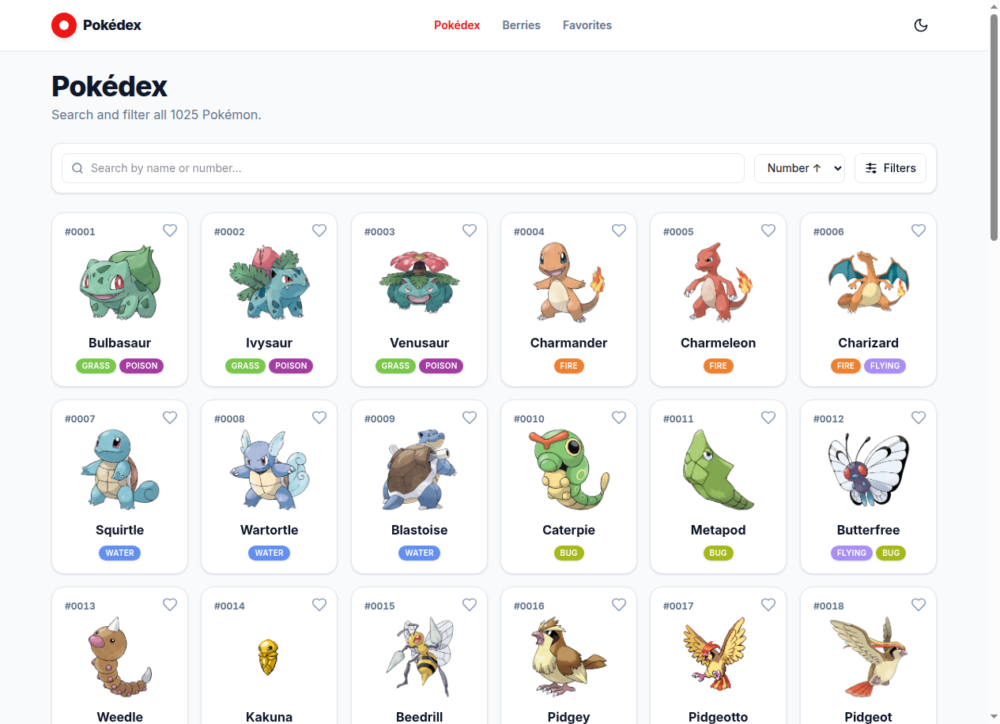
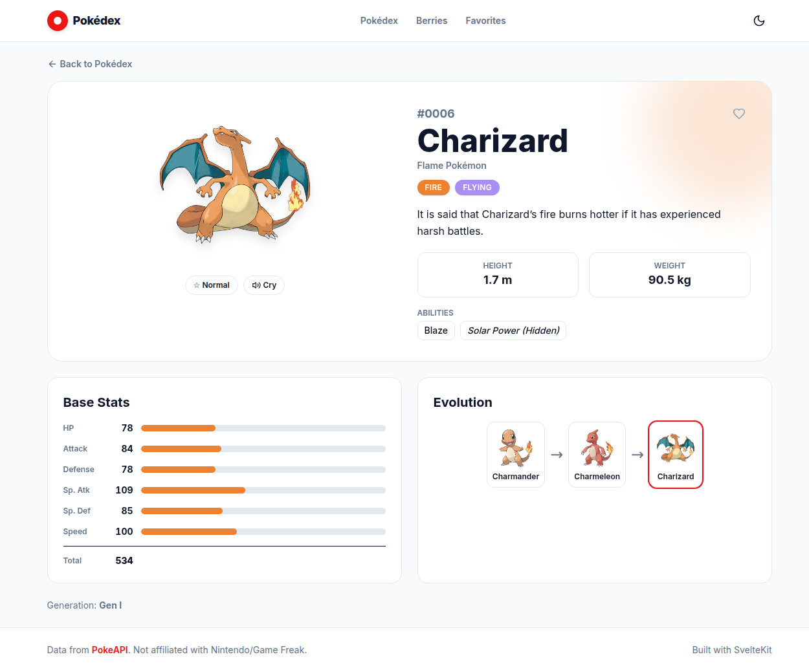
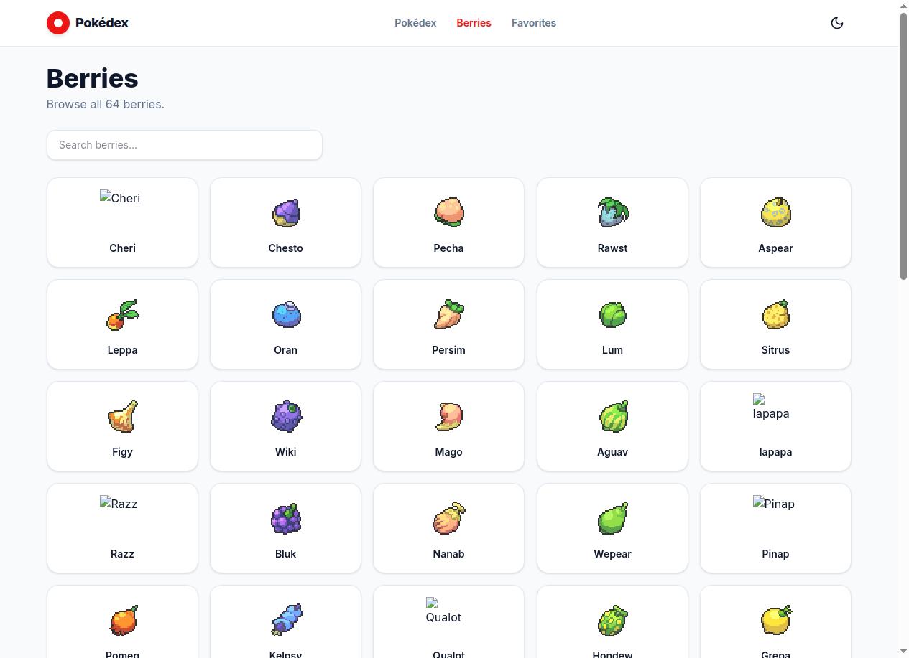
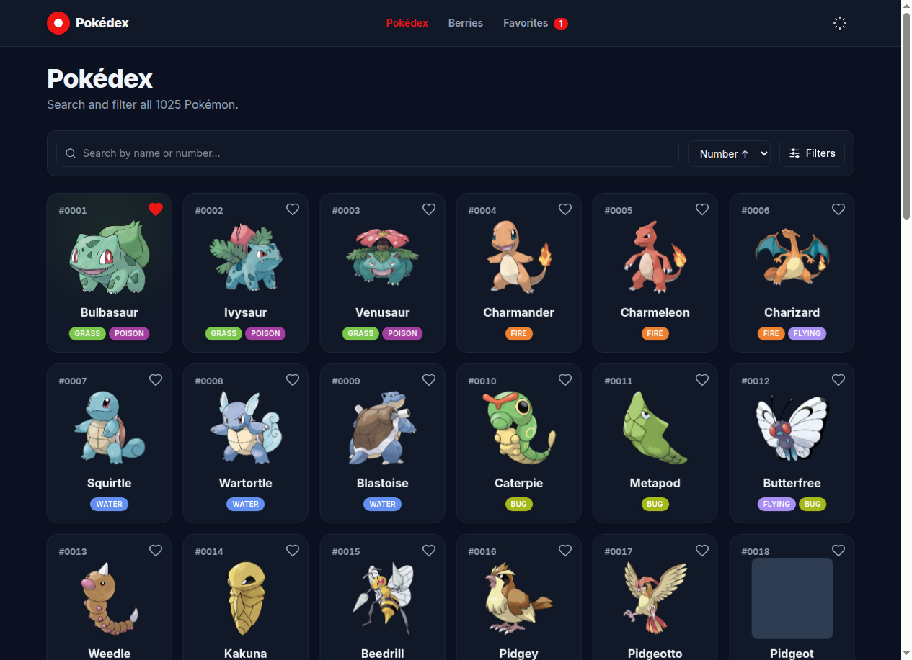
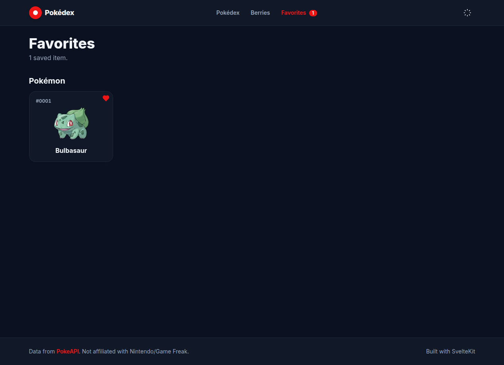

<div align="center">

# ⚡ Pokédex

### A polished, animated Pokédex for all 1025 Pokémon — built with SvelteKit 5 & the PokeAPI.

[**🔴 Live Demo → azagatti.github.io/pokedex-tw-opus-on**](https://azagatti.github.io/pokedex-tw-opus-on/)

      [](https://github.com/AZagatti/pokedex-tw-opus-on/actions/workflows/ci.yml) 

</div>

---



## ✨ Features

- **All 1025 Pokémon** — browsable grid with official artwork, national-dex numbers, and colour-coded type badges.
- **Instant search & filter** — debounced name/number search, filter by generation and by multiple types, and four sort orders. All client-side over a pre-built index (no waterfall of 1025 requests).
- **Infinite scroll** — `IntersectionObserver`-driven pagination that stays smooth at any list size.
- **Rich detail pages** — animated stat bars, abilities (incl. hidden), full evolution chains with branching, shiny toggle, Pokémon cry playback, and generation info.
- **Berries index** — all 64 berries with firmness, flavours, growth data, and their own detail pages.
- **Favorites** — star any Pokémon or berry; persisted to `localStorage` and surfaced on a dedicated page.
- **Dark mode** — system-aware, persisted, and applied before first paint (no flash).
- **Accessible** — semantic landmarks, skip-link, keyboard-navigable, `aria` states, and `prefers-reduced-motion` support.
- **Fast** — in-memory request cache, lazy images, and a static SPA served from GitHub Pages.

## 📸 Screenshots

| Detail page | Berries |
| --- | --- |
|  |  |

| Dark mode | Favorites |
| --- | --- |
|  |  |

## 🛠 Tech stack

| Concern | Choice |
| --- | --- |
| Framework | **SvelteKit 2** + **Svelte 5** (runes) |
| Language | **TypeScript** (strict) |
| Styling | **Tailwind CSS 4** (`@theme`, CSS-first) |
| Data | **PokeAPI** via native `fetch` + in-memory cache; **Zod** validation |
| Icons | Local inline-SVG component (zero icon-lib runtime) |
| Lint / format | **oxlint** + **oxfmt** (via **ultracite** presets) |
| Git hooks | **lefthook** (pre-commit: lint/format/typecheck · pre-push: unit tests) |
| Tests | **Vitest** (unit + component) · **Playwright** (e2e) |
| Hosting | **GitHub Pages** via **adapter-static** (SPA) + GitHub Actions |

## 🚀 Run locally

```bash
# Requires Node 22+
npm install
npm run dev          # start dev server at http://localhost:5173

npm run build        # production build (static, for Pages)
npm run preview      # preview the production build

npm run check        # svelte-check (type-check)
npm run lint         # oxlint
npm run format       # oxfmt --write
npm run test:unit    # Vitest
npm run test:e2e     # Playwright
npm run test         # unit + e2e
```

> The GitHub Pages build sets `BASE_PATH=/pokedex-tw-opus-on`. Locally the base path is empty, so routes work at the root.

## 🏗 Architecture

A single-page app that fetches everything client-side from PokeAPI and caches it in memory.

```
src/
├─ lib/
│  ├─ api/       cache · zod schemas · typed client · search-index builder
│  ├─ components/ PokemonCard · TypeBadge · StatBar · EvolutionChain · Icon · …
│  ├─ stores/    favorites & theme (Svelte 5 runes + localStorage)
│  └─ utils/     formatting helpers, type/generation tables
└─ routes/
   ├─ +page.svelte              list (search · filter · sort · infinite scroll)
   ├─ pokemon/[name]/           detail (stats · evolution · sprites · cry)
   ├─ berries/ , berries/[name] berry index + detail
   ├─ favorites/                saved Pokémon & berries
   └─ +error.svelte             404
```

**The clever bit:** instead of 1025 individual requests to populate the grid, the search index is built from **18 type endpoints + 9 generation endpoints** (~27 cached requests) and merged into one `IndexEntry[]` with id, name, types, and generation — enabling instant client-side search, filter, and sort. See [`docs/ARCHITECTURE.md`](docs/ARCHITECTURE.md).

## 📚 Docs

- [`docs/ARCHITECTURE.md`](docs/ARCHITECTURE.md) — data flow, caching, routes, rendering.
- [`docs/DECISIONS.md`](docs/DECISIONS.md) — why each pinned tech choice.

## 📄 License

MIT. Pokémon data © Nintendo/Game Freak, served via [PokeAPI](https://pokeapi.co). This is a non-commercial fan project.
